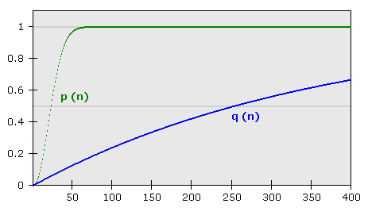

.. -*- coding: utf-8 -*-

==================================
Example of reStructuredText markup
==================================

:Author: Nathaniel Beaver
:Date: $Date: 2014-08-01 (Friday, 1 August 2014) $
:Copyright: This document has been placed in the public domain.

If you are reading an output format like HTML,
the source file is `<../readme.rst>`_.
If you are reading on Github,
the source file is `<./readme.rst>`_.
(Note that Github does not support all reStructuredText directives;
notably the `math directive`_ is `not supported`_ `at all`_ as of June 2019.)

.. _math directive: https://docutils.readthedocs.io/en/sphinx-docs/ref/rst/directives.html?highlight=math#math
.. _not supported: https://github.com/github/markup/issues/83
.. _at all: https://github.com/github/markup/issues/274

This is meant to be read from the source file.
It is more of a template than a tutorial,
and reading the output is not as helpful.

See also the official reStructuredText demo:

http://docutils.sourceforge.net/docs/user/rst/demo.txt

http://docutils.sourceforge.net/docs/user/rst/demo.html

.. /usr/share/doc/docutils-doc/docs/user/rst/demo.txt

Unofficial guides:

http://www.trueelena.org/computers/articles/restructuredtext_for_fiction.html

Run the `Makefile <../Makefile>`_ to generate HTML by default,
or ``make all`` to generate all possible formats.

.. contents::

------------------
Hyperlinks to URLs
------------------

Plain hyperlinks will usually work:

https://en.wikipedia.org/wiki/ReStructuredText

The `reStructuredText specification`_ is on Sourceforge,
as is the `docutils Quick Reference`_.

The `Wikipedia page`_ on reST is also helpful,
as is the Sphinx_ documentation generator page.

.. _Sphinx: http://sphinx-doc.org/rest.html
.. _reStructuredText specification: http://docutils.sourceforge.net/docs/ref/rst/restructuredtext.html
.. _Wikipedia page: https://en.wikipedia.org/wiki/ReStructuredText
.. _docutils Quick Reference: http://docutils.sourceforge.net/docs/user/rst/quickref.html

`Inline hyperlinks <http://docutils.sourceforge.net/docs/ref/rst/restructuredtext.html#hyperlink-references>`_
are also possible,
although I find them harder to read in the source markup.

`Anonymous hyperlinks`__ are also possible
if you don't want to name your hyperlinks,
or if you want two hyperlinks with the same text
(e.g. Georgia__ or Georgia__, can__ or can__).

__ http://docutils.sourceforge.net/docs/ref/rst/restructuredtext.html#anonymous-hyperlinks
__ https://en.wiktionary.org/wiki/Georgia#Etymology_1
__ https://en.wiktionary.org/wiki/Georgia#Etymology_2
__ https://en.wiktionary.org/wiki/can#Verb
__ https://en.wiktionary.org/wiki/can#Noun

They are assigned by the order of the links in the document,
unlike named hyperlink targets where order is irrelevant.

Some characters must be escaped in links,
including some characters in URLs.
Backslashes (``\``) must be escaped in both the link text and the target,
a leading underscore (``_``) must be escaped in the target,
and colons (``:``) must be escaped anywhere in the target.

.. TODO: finish examples of these rules and why they make sense.

For example, to link to the title
"`LaTeX: a document preparation system`_",
the colon does *not* need to be escaped in the link text,
but it does in the target.

.. _LaTeX\: a document preparation system: https://www.worldcat.org/title/latex-a-document-preparation-system-users-guide-and-reference-manual/oclc/29225162

To link to `_why`_,
the leading underscore does *not* need to be escaped in the link text,
but it does in the target.

.. _\_why: https://en.wikipedia.org/wiki/Why_the_lucky_stiff

To link to `C:\\Program Files\\`_,
the backslash must be escaped in *both* the link text and the target.

.. _C:\\Program Files\\: https://en.wikipedia.org/wiki/Program_Files

The `backtick (\`)`_ must be escaped in the link text,
but does not need to be escaped in the target.

.. _backtick (`): https://en.wikipedia.org/wiki/Grave_accent

----------------------
Linking to local files
----------------------

Relative and absolute links both work.

For example, we can make a relative link to `the source file`_ in the parent directory,
or link to the same `file inline <../readme.rst>`_.

.. _the source file: ../readme.rst

Absolute links are done similarly.

`Root directory`_

.. _Root directory: /

- `</etc/>`_
- `</home/>`_
- `</tmp/>`_
- `</var/>`_
- `<C:/Users>`_

------
Images
------

Path to image on Github page:

Path to image on local version
(HTML file is in ``out/``, so image is in parent directory):

.. image:: ../birthday-paradox.png
   :width: 463px
   :alt: the birthday paradox
   :target: https://commons.wikimedia.org/wiki/File:050329-birthday1.png

In HTML output, this generates an ``img`` tag.
A limited subset of image attributes are supported,
including ``alt``, ``height``, ``width``, ``scale``, ``align``, ``target``.

Tags can be wrapped by aligning with the indentation:

.. image:: ../birthday-paradox.png
   :width: 463px
   :target: https://commons.wikimedia.org/wiki/File:050329-birthday1.png
   :alt: This is a very long alt tag that continues on and is eventually
         wrapped onto the next line.

The ``height`` and ``width`` attributes can be expressed in units of length
like pixels, or as a percentage of the page.

.. image:: ../birthday-paradox.png
   :width: 85%
   :alt: This image has a width that is 85% of the width of the page.

More documentation here:

http://docutils.sourceforge.net/docs/ref/rst/directives.html#image

----------------------------------------
Internal hyperlinks and cross references
----------------------------------------

Linking to the section on `how to do math`_.

.. _how to do math: `Math markup`_

Inline link to `the title <Example of reStructuredText markup_>`_.

Linking to the section on `unordered/bulleted lists`_.

.. _unordered/bulleted lists: `Bulleted lists.`_

Linking to an `arbitrary cross-reference target`_.

.. _arbitrary cross-reference target: `arbitrary`_

blah
blah
blah
blah

.. _arbitrary:

blah
blah
blah
blah

--------
Sections
--------

From the documentation:

- Underline is different than underline and overline.
- Do not indent the title for underline-only section titles.
- Valid section adornment characters: ``! " # $ % & ' ( ) * + , - . / : ; < = > ? @ [ \ ] ^ _ ` { | } ~`` 
- Reccomended section adornment characters: ``= - ` : . ' " ~ ^ _ * + #``

http://docutils.sourceforge.net/docs/ref/rst/restructuredtext.html#sections

-------------------------------------------------
Literal blocks (a.k.a. code, verbatim, monospace)
-------------------------------------------------

Example of turning an ``rst`` markup document into HTML::

    rst2html reStructuredText.rst reStructuredText.html

-----------
Math markup
-----------

The quadratic equation, :math:`a x^2 + b x + c = 0`, has two solutions, :math:`x = \frac{-b \pm \sqrt{b^2 - 4 a c} }{2 a}`.

The Einstein field equations.

.. math::
   G_{\mu\nu} \equiv R_{\mu\nu} - \frac{1}{2} R g_{\mu\nu} = \frac{8 \pi G}{c^4} T_{\mu\nu}

You can also use MathJax by defining a raw-latex directive.

.. role:: raw-latex(raw)
    :format: latex html

.. raw:: html

    

Inline math is done like this: :raw-latex:`\( \vec{F} = e \vec{v} \times \vec{B} \)`

Displayed math is done like this:

.. raw:: latex html

  \[ e \vec{v} \times \vec{B} = m \frac{d \vec{v}}{dt} \]

References:

- http://docutils.sourceforge.net/docs/ref/rst/roles.html#math
- http://docutils.sourceforge.net/docs/ref/rst/directives.html#math

-------------------------
Superscript and subscript
-------------------------

Subscripts and superscripts can be done like so:
:superscript:`this text is superscript`
:subscript:`this text is subscript`.

If you want the superscript right after some text
without additional space,
use a backslash preceding the space.
For example: the density of lead at standard temperature and pressure
is 11.34 g/cm\ :sup:`3`.

This is sufficient for exponents and simple chemical reactions,
such as lithium uptake reaction for the cathode material
in a lithium iron phosphate battery:

FePO\ :sub:`4` + Li\ :sup:`+` + e\ :sup:`-` →  LiFePO\ :sub:`4`

or the thermite reaction:

2 Al + Fe\ :sub:`2`\ O\ :sub:`3` → 2 Fe + Al\ :sub:`2`\ O\ :sub:`3`

However, it is not sufficient for more complex formatting
such as isotopes. However, this can be done reasonably well in math mode.
Here is a fusion reaction between deuterium and tritium:

.. math::
    ^{2}_{1}\mathrm{D} + ^{3}_{1}\mathrm{T} \to
    ^{4}_{2}\mathrm{He} \mathrm{(3.5 MeV)} +
    n^{0} \mathrm{(14.1 MeV)}

Writing out chemical formulas repeatedly with ``:sup:`` and ``:sub:``
can get tiresome.
To make this easier, we can use the ``replace::`` directive like so:

.. |H2O| replace:: H\ :sub:`2`\ O
.. |H2| replace:: H\ :sub:`2`
.. |O2| replace:: O\ :sub:`2`

Now we can use them like this:

2 |H2| + |O2| → 2 |H2O|

References:

- http://docutils.sourceforge.net/docs/ref/rst/roles.html#subscript

- https://docutils.sourceforge.io/docs/ref/rst/directives.html#replacement-text

-----------------------
Footnotes and citations
-----------------------

Cheese is delicious. [#cheese]_

Labeled footnotes? Why bother? [#]_
(Don't forget that space between the body text and the ``[#]_``;
you won't get an error, but the footnote won't show up.)

Symbolic footnotes: there are ten symbols to run through
before it starts doubling them up.
[*]_ [*]_ [*]_ [*]_ [*]_ [*]_ [*]_ [*]_ [*]_ [*]_ [*]_

Citations with the label instead of a number are easy. [jdoe2014]_

Note that the location of a footnote's target
does affect the placement of the footnotes in the document.
So if you want the footnotes to actually be at the bottom of the document,
you have to put the target down there, too.

.. [#cheese] Here's an example of a multi-line footnote:
   cheese varieties include
   brie,
   cheddar,
   edom,
   emmentaler,
   jarlsberg,
   fontina,
   gouda,
   limburger,
   mascarpone,
   parmesan,
   provolone,
   and more!
.. [#] You can always add a label later.
.. [*] Asterisk `*`.
.. [*] Dagger `†`.

.. [*] Double dagger `‡`.

.. [*] Section sign `§`.
.. [*] Pilcrow/paragraph sign `¶`.
.. [*] Number sign `#`.
.. [*] Black spade suit `♠`.
.. [*] Black heart suit `♥`.
.. [*] Black diamond suit `♠`.
.. [*] Black club suit `♣`.
.. [*] Double asterisk `**`.
.. [jdoe2014] Doe, John. Bulletin of Stuff. 2104.

------
Tables
------

A multiplication table.

+---+---+---+---+---+
|   | 1 | 2 | 3 | 4 |
+---+---+---+---+---+
| 1 | 1 | 2 | 3 | 4 |
+---+---+---+---+---+
| 2 | 2 | 4 | 6 | 8 |
+---+---+---+---+---+
| 3 | 3 | 6 | 9 | 12|
+---+---+---+---+---+
| 4 | 4 | 8 | 12| 16|
+---+---+---+---+---+

A less laborious multiplication table;
the first cell cannot be empty or have multiple lines.

= = = == ==
x 1 2 3  4
1 1 2 3  4
2 2 4 3  8
3 3 6 9  12
4 4 8 12 16
= = = == ==

Tables with a header row.

+---+---+
| X | Y |
+===+===+
| 1 | 1 |
+---+---+
| 2 | 4 |
+---+---+
| 3 | 9 |
+---+---+
| 4 | 16|
+---+---+

= ==
X Y
= ==
1 1
2 4
3 9
4 16
= ==

Lists in tables.

+-------+-------+
| - 1st | - 4th |
| - 2nd | - 5th |
| - 3rd | - 6th |
+-------+-------+

---------------
Bulleted lists.
---------------

- One
  example
- using hyphens.

* Another
  using
* asterisks.

+ Another
  using
+ plus signs.

+ Nesting levels: 1st.

  * 2nd level.
  * 2nd level again.

    - 3rd level.
    - 3rd level again.

      * 4th level.
      * 4th level again.

        + 5th level.

--------
Comments
--------

Any language benefits from the ability to comment things out.

.. This won't appear,
   since we used two dots.

If we use ``rst2html``, we get this output::

    <!-- This won't appear,
    since we used two dots. -->

If we use ``rst2latex``, we get this output::

    % This won't appear,
    % since we used two dots.

-------
Quoting
-------

    This is a block quote.
    It is indented, and does not preserve line-breaks.
    
    If you want to start a new paragraph, you must leave a blank line.

| This is a line block.
| It preserves line-breaks, and is useful for poems and other verse.

    | This is an indented line block.
    | It preserves line-breaks, and is useful for poems and other verse.

::

    This is a literal block.
    It is indented, uses monspace font, and preserves line-breaks.
    Don't forget to leave a blank space before the leading ::.

.. TODO: substitutions and substitution definitions.
